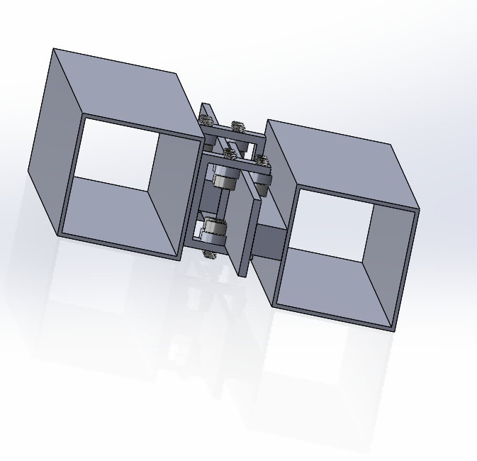

# System Design #

To meet the performance specifications, we are designing a mechatronic device that incorporates a microcontroller for system control, a vision algorithm to determine positioning on frame, and mechanisms to grip, pivot and extend to move along the window frame. 

The robot is comprised of three separate units: a gripping unit, an extending unit and a washing unit. The gripping unit is placed on the two ends of the robot to hold the robot onto the sides of the window frame. Since there is a short distance between the top of the frame and the window, these grippers cover a large surface area parallel to the window to apply more pressure. This also more effectively counters moments due to the weight of the robot. A motor with a planetary gearbox is attached to the gripper to create a pivoting motion about the gripper. The extending unit consists of two offset beams attached together with bearings in a bracket, forming a linear slide. The motion of the beams is driven by a belt rotated about a pulley for extension and contraction. The cleaning unit moves along the extending unit using rollers secured in grooves. 

At the beginning of the window washing process, the robot starts in its contracted form, in order to conform to the footprint restriction, and is held onto the frame with one gripper. The robot then extends towards the other side of the frame and, using a camera on the gripper, it locates itself and grips on to secure itself. Then, the cleaning unit slides back and forth to clean the area along the extending unit. To move up the frame, the robot releases and extends in a diagonal motion and uses the same vision algorithm for location sensing. 

As we continue to develop our robot, we will outline the various design changes that were implemented or discarded. 
