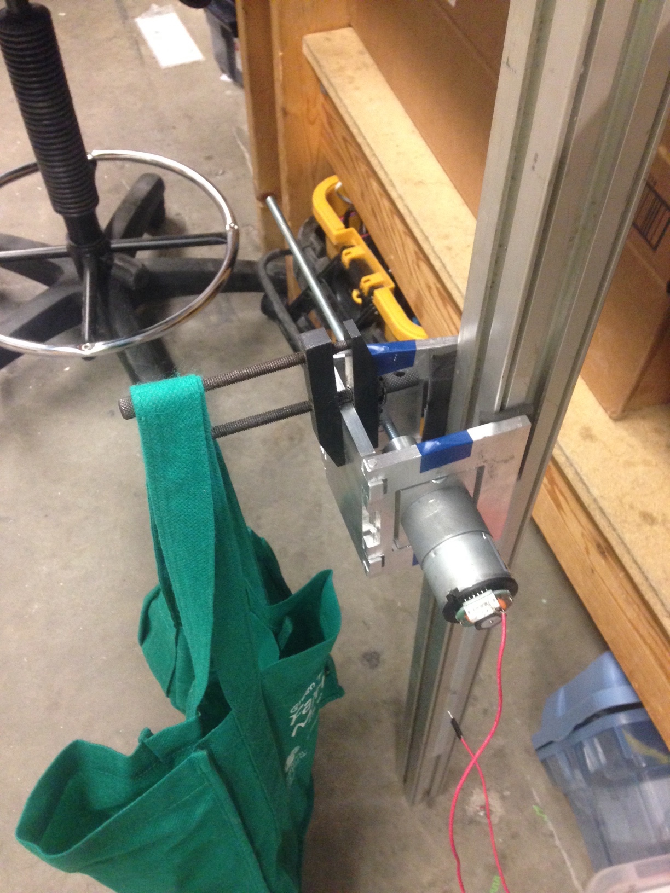
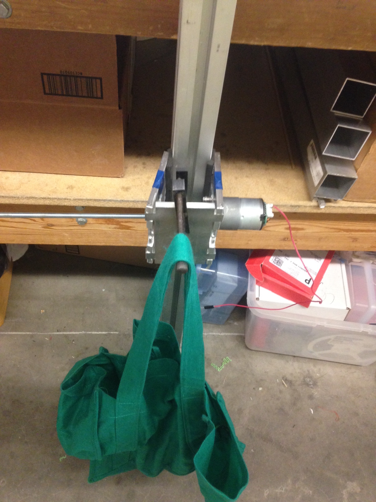
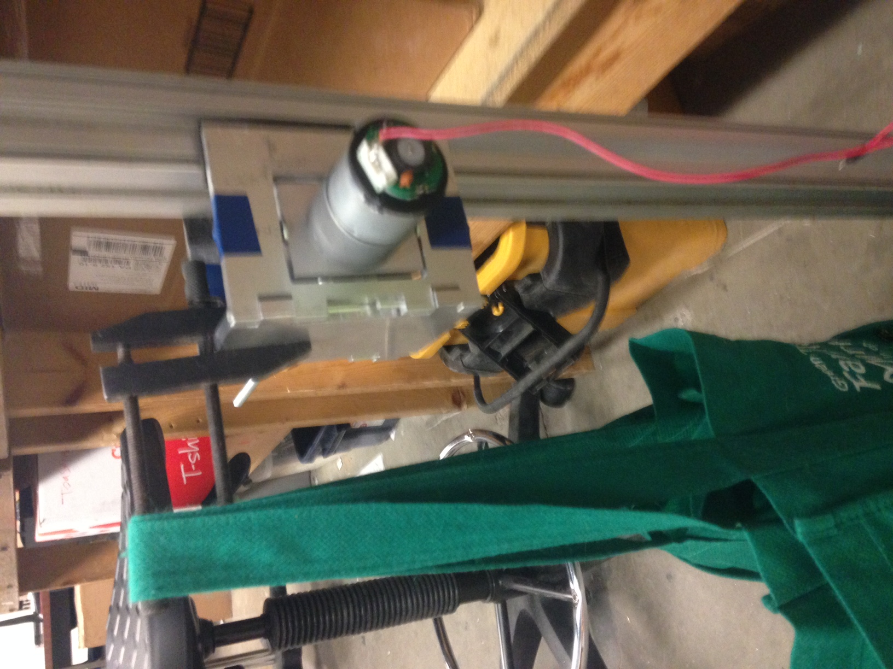

# System Performance #

Gripper Test:
   A quick test was run to figure out how much weight our current gripper prototype could support.  A clamp was attached to the gripper and a bag was hung off of the clamp at the distance that we expect the center of mass of the robot to be away from the window.  Weight was added to the bag until failure, which occured at around 5 lbs.
   
   
   
